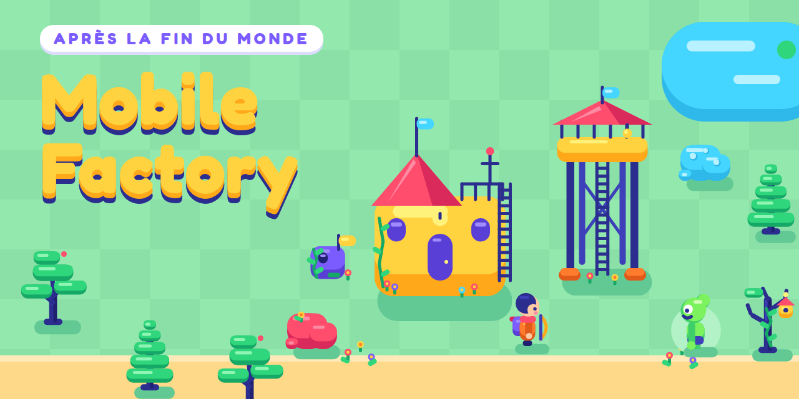

# Mobile Factory

**[▶ Jouer](https://cardona.digital/mobile-factory/)** — dans le navigateur,
téléphone compris.

Jeu d'usine 2D pour navigateur mobile, en TypeScript et PixiJS. On explore une
carte générée à l'infini, on pose des machines qui extraient et transforment des
ressources, et on fait circuler les matériaux — non pas par des convoyeurs, mais
par des **porteurs** qui parcourent physiquement la distance entre les
bâtiments.

## Ce qui marche aujourd'hui

La verticale jouable s'arrête après le placement au tap. Tout ce qui suit est
jouable dans le navigateur, sur téléphone :

- un **écran titre** (le pitch, les commandes, « Jouer ») et une **pause**
  — bouton, `Échap`/`P`, ou automatique quand l'onglet passe en arrière-plan ;
- une direction artistique **vectorielle « post-apo joyeux »** : chaque
  sprite est un SVG construit avec les helpers de `src/data/artDirection.ts`
  (formes pures, trois tons, palette courte, aucun contour), rastérisé une
  fois à la résolution de l'écran dans un atlas, et animé par morceaux —
  cf. [`docs/art-direction.md`](docs/art-direction.md) ;
- carte chunkée générée depuis une seed, sol baké en RenderTexture : damier
  d'herbe, sable, étangs et plateaux de roche aux coins arrondis, décor de
  ruines fleuries ; arbres et rochers triés en profondeur, ombres portées
  pleines ;
- caméra amortie qui anticipe la marche et **tremble** aux impacts, culling
  et éviction par chunk ;
- boucle à pas fixe 20 TPS, rendu interpolé à la fréquence de l'écran ;
- joystick virtuel fixe, toujours affiché au doigt, à sortie analogique ; sur PC, déplacement au
  clavier — ZQSD, WASD ou flèches, lu par position physique des touches, donc
  sans réglage entre AZERTY et QWERTY ;
- une foreuse qui extrait le gisement sous elle dans son coffre interne ;
- placement au tap en deux temps, avec aperçu fantôme ;
- récolte de proximité : Adam passe près d'un arbre ou d'un rocher et le
  récolte en marchant (éclats, tremblement, son) ; il se faufile entre les
  troncs, une forêt n'est jamais un mur ; il livre le chantier de la mairie
  en le heurtant ;
- une fenêtre d'inspection au tap sur un chantier ou un bâtiment ;
- une **nurserie** qui fait naître un enfant toutes les trois minutes, et une
  **tour de guet** qui tire seule ;
- des **habitants qui vieillissent** — un cycle jour/nuit, un an : l'enfant
  sort de la nurserie à 10 ans, joue, et devient ouvrier à 14 ; l'ouvrier sans
  travail glande à la vue de tous (assis, adossé, il s'étire, il bâille), et
  le HUD compte au travail / inactifs / enfants ;
- des **mutants radioactifs** par vagues, dès que la mairie est debout : ils
  marchent droit sur elle et cassent ce qui les bloque ; l'arc d'Adam tire
  automatiquement sur le plus proche ; si la mairie tombe, la partie est perdue ;
- un HUD de jeu vidéo : quête avec une barre par ressource, santé de la
  mairie, compte à rebours de la prochaine vague (3, 2, 1 au centre de
  l'écran), population et mutants abattus ; un **conseil** contextuel qui
  sert de tutoriel ; des gains qui jaillissent de la tête d'Adam ; des bulles
  empilées ; des **flèches au bord de l'écran** vers les mutants hors champ
  et vers la mairie ; un bilan de partie à la défaite ;
- du ressenti : bâtiments qui sortent du sol en rebondissant, qui rougissent,
  tremblent et se cabossent sous les coups, mutants qui grimacent à l'impact
  et s'écrasent en mourant, arc qui se tend à chaque tir, éclats colorés à
  chaque construction, vignette qui vire au rouge pendant une attaque ;
- sons et musique de fond synthétisés en Web Audio, sans fichier audio ;
  police arrondie (Fredoka) embarquée dans le build, donc disponible hors ligne.

Entrepôt, porteurs, assembleur, recherche et électricité viendront ensuite.

## Démarrer

```bash
npm install
npm run dev -- --host   # --host pour ouvrir depuis un vrai téléphone
```

L'émulateur tactile de Chrome ment sur la latence et sur le multitouch. Le
joystick et le placement se testent sur un appareil réel, dès le premier jour.

Une seed peut être forcée dans l'URL — `?seed=1234` — pour retomber exactement
sur la même carte, ce qui rend un bug de génération reproductible. En dev,
`?debug` (ou la touche `²`) affiche le panneau de statistiques.

| Commande            | Effet                                    |
| ------------------- | ---------------------------------------- |
| `npm run dev`       | serveur de développement                 |
| `npm run build`     | typecheck puis build de production       |
| `npm run lint`      | ESLint, garde-fou d'isolation compris    |
| `npm run typecheck` | TypeScript strict                        |
| `npm test`          | Vitest, headless, sans canvas            |

## Stack

- **PixiJS v8** — un renderer, pas un moteur de jeu. Boucle, collisions,
  scènes et découpage spatial sont écrits ici. Plus de code au départ qu'avec
  Phaser, en échange du contrôle complet de l'architecture.
- **TypeScript** en mode strict, `noUncheckedIndexedAccess` compris.
- **Vite** (template `vanilla-ts`).
- **Vitest** en environnement Node — aucun canvas n'est nécessaire pour tester
  la simulation.
- **PWA d'abord.** Capacitor plus tard, et seulement s'il faut publier sur les
  stores.

La 2D n'est pas un repli : elle est bien plus légère en batterie et en GPU sur
mobile, et un modèle 3D généré ne donne de toute façon pas un asset jouable — il
reste la retopologie, l'UV, le rig et les animations.

## La règle qui tient tout

**`sim/` n'importe jamais `render/`, ni `pixi.js`, ni le DOM.**

C'est la seule règle non négociable du projet. Elle donne gratuitement trois
choses :

- des tests headless — `new World(seed)` puis `world.tick()`, sans navigateur ;
- une sauvegarde qui n'est qu'une sérialisation de l'état de simulation ;
- la possibilité de déplacer toute la simulation dans un Web Worker plus tard,
  sans rien réécrire.

Une règle de ce genre s'érode en trois semaines si personne ne la fait
respecter. Elle est donc appliquée par ESLint et vérifiée en CI :

```js
{
  files: ['src/sim/**', 'src/data/**'],
  rules: {
    '@typescript-eslint/no-restricted-imports': [
      'error',
      { patterns: ['pixi.js', '**/render/*', '**/ui/*'] },
    ],
  },
}
```

La variante `typescript-eslint` est volontaire : elle voit aussi les
`import type`, que la règle ESLint native laisse passer.

## Arborescence

```
src/
  core/     rng, grid, events          — briques sans dépendance
  data/     items, recipes, buildings, enemies, weapons, sprites,
            artDirection — contenu pur, aucune logique
  art/      un module SVG par sprite, le sol, les pictogrammes
  sim/      world, scheduler, chunk, terrain, store, player, motion,
            enemies, combat, kids, commands
  render/   renderer, camera, chunkLayer, resourceLayer, entityLayer,
            mobileLayer, puppet, particles, ghostLayer, spriteLibrary, atlas
  input/    joystick, keyboard, pointer, placement, inspect
  ui/       hud, buildMenu, buildingPanel
  audio/    engine, synth, music       — Web Audio, sons procéduraux
  tools/    artSheet, brand            — planche de relecture, icône, bannière
  main.ts   câblage uniquement
```

## Quelques décisions

**Boucle à pas fixe.** La simulation avance à 20 TPS, le rendu interpole. Un
accumulateur clampé à 250 ms empêche la spirale de la mort : sans lui, revenir
sur l'onglet après deux minutes en arrière-plan tenterait de rattraper 2 400
ticks en une frame et gèlerait l'application.

**Aucune entité ne se tick à chaque frame.** Une machine se replanifie
elle-même, et ne se replanifie pas du tout quand elle est bloquée — c'est
l'événement qui libère sa sortie qui la réveille. Le scheduler est une roue de
256 slots doublée d'une map pour les délais longs, en O(1). Dix mille machines
coûtent quelques centaines de réveils par tick au lieu de 200 000 appels par
seconde. Une tour de guet ne se replanifie que tant qu'il reste des mutants.

**Les mobiles, eux, bougent à chaque tick.** Mutants, flèches et enfants sont
peu nombreux ; c'est ce qui rend acceptable ce que le scheduler interdit aux
bâtiments. Un mutant n'a pas de pathfinding : il traverse l'eau et les
forêts, et casse le bâti qui le bloque. On ne le piège pas, on le tue.

**Le son est synthétisé.** Aucun fichier audio : chaque effet est fabriqué
avec des oscillateurs et du bruit filtré, la musique de fond est une boucle
chiptune séquencée sur l'horloge audio. Rien ne joue avant un geste du
joueur, comme les navigateurs mobiles l'exigent ; le bouton en haut à gauche
coupe tout, et ce réglage survit au rechargement.

**Le contenu est de la donnée.** Objets, recettes et bâtiments sont déclarés en
`as const satisfies Record<string, XProto>` : TypeScript en dérive les unions
d'ids, et une faute de frappe dans un ingrédient devient une erreur de
compilation. Un `validatePrototypes()` tourne au démarrage en développement pour
attraper ce que le typage ne voit pas — une recette sans bâtiment capable, une
quantité nulle, un libellé dupliqué.

**La carte n'est jamais stockée.** Terrain et gisements sont régénérés depuis la
seed ; seules les modifications du joueur sont sauvegardées. Une partie de dix
heures tient dans quelques centaines de kilo-octets.

**L'UI ne modifie jamais l'état.** Elle pousse une commande, que le tick
consomme. Une partie se résume donc à une seed et à un journal de commandes
horodatées : rejouabilité, undo trivial, et le canal vers un Web Worker déjà
défini.

**Les réservations sont prises à la création du job**, pas à sa prise en charge.
Le `Store` tient une double comptabilité — stock, sortant, entrant — et toute
décision se prend sur `available()` et `freeSpace()`, jamais sur le stock brut.
C'est là que les jeux de colonie se cassent, sous charge, quand deux porteurs
partent chercher le même tas. Ici le second job ne peut pas voir ce stock : le
bug n'existe pas structurellement.

## À ne pas faire

Pas d'ECS complet — une `Map<EntityId, Entity>` avec union discriminée est plus
lisible, et `sim/` étant isolé, le stockage se changera sans toucher au rendu.
Pas de moteur physique : il n'y a pas de dynamique dans un jeu d'usine, la
grille et des AABB suffisent. Pas de multijoueur — mais le pas fixe, le PRNG à
seed et les commandes laissent la porte ouverte au lockstep déterministe. Ne pas
fermer cette porte, ne pas ouvrir ce chantier.

Et pas d'optimisation sans mesure : PixiJS Devtools et l'onglet Performance de
Chrome, sur un vrai téléphone.

## Déploiement

Chaque push sur `main` construit le jeu et le publie sur GitHub Pages, à
[cardona.digital/mobile-factory](https://cardona.digital/mobile-factory/)
(`.github/workflows/deploy.yml`).

Le site est servi sous un sous-chemin, d'où le `base` de `vite.config.ts`. Ces
deux valeurs doivent rester d'accord : si le dépôt est renommé, l'une sans
l'autre donne un écran noir.

## Auteur

[Salvador Cardona](https://cardona.digital)

## Licence

MIT
