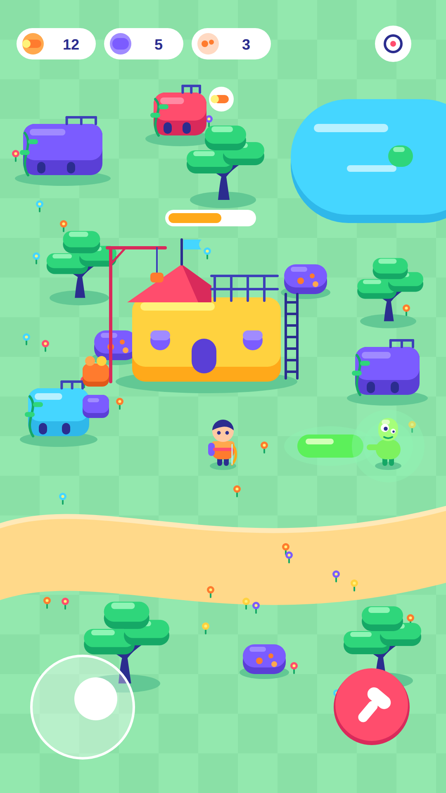
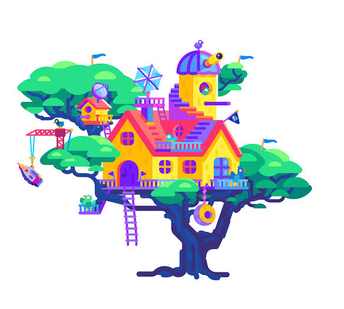
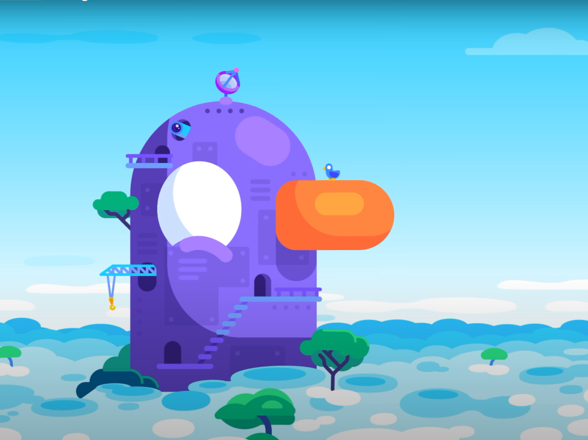
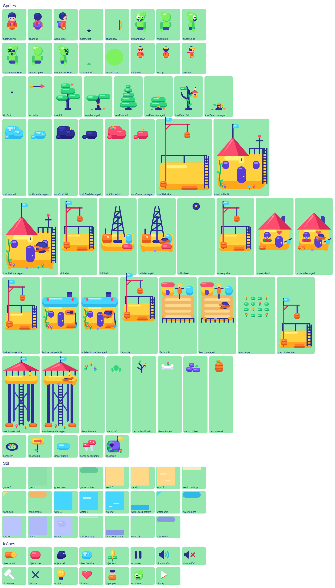

# Direction artistique

Ce document est la référence visuelle du projet. Sa version exécutable est
`src/data/artDirection.ts` : la palette, les rayons, le trait, la lumière, et
les helpers SVG avec lesquels **tout** visuel est construit. **Si ce document
et ce fichier ne disent pas la même chose, c'est le fichier qui a raison, et
ce document qu'il faut corriger.**

Avant de créer ou de modifier un visuel, charger le skill
`.claude/skills/art-direction/` : il résume ces règles et donne la check-list
de relecture.

## En une phrase

**Vectoriel « post-apo joyeux » : la vie reprend ses droits sur la ruine.**

Des ruines de bâtiments arrondis envahies de lianes, des fleurs partout, des
drapeaux, des échelles, des grues, des antennes : la fin du monde est passée
et c'est plutôt gai. Les mutants sont drôles plus qu'effrayants.

Chaque sprite est du **SVG écrit à la main**, construit avec les helpers de
`artDirection.ts` : cohérent, net sur tous les écrans, animé par morceaux.
Plus de pixel art, plus de planche générée par un modèle d'image.

## Références

| | |
| --- | --- |
|  | **Maquette validée** — l'écran de jeu dans ce style, vue de dessus 3/4, format téléphone. La palette de `artDirection.ts` en est relevée au pixel. |
|  | **Référence de l'illustrateur** — la cabane : coussins de feuillage empilés sur un tronc indigo ramifié, échelles, grue, drapeaux, rambardes. |
|  | **Référence de l'illustrateur** — la tour : un volume arrondi en trois tons, lumière en haut à gauche, détails fonctionnels au trait. |

Les règles ci-dessous viennent de ces dessins. Adam, Ève et les mutants
restent des créations originales : on reprend une grammaire, pas un personnage.

## Les dix règles

1. **Formes géométriques pures** : capsules, rectangles très arrondis, cercles
   parfaits. Rayons cohérents d'un objet à l'autre. **Aucun contour** autour
   des formes.
2. **Trois tons par objet** : couleur de base ; ombre de la **même teinte
   tirée vers le violet/bleu** (jamais du gris, jamais du noir, jamais une
   transparence noire) ; reflet en **capsule claire** à l'intérieur de la
   forme. Lumière toujours **en haut à gauche**.
3. **Palette courte et saturée** : violet, jaune, rose corail, orange, vert
   menthe, cyan, et un **indigo profond** qui remplace le noir et le marron
   (les troncs sont indigo).
4. **Traits réservés aux petits détails** (échelles, rambardes, grues,
   antennes, hampes) : **une seule épaisseur**, bouts arrondis, couleur indigo
   ou teinte foncée de l'objet. Pas de trait à main levée, pas de courbe
   hasardeuse : lianes = tracé régulier + feuilles en capsule.
5. **Arbres** : coussins de feuillage aplatis et empilés (base foncée + dessus
   + reflet), sur un tronc indigo qui se ramifie. Pas de boules.
6. **Détails fonctionnels qui racontent une vie** (drapeaux, échelles, grues,
   rambardes, antennes, lianes, fleurs) plutôt que de la texture.
7. **Ombres portées pleines**, d'une teinte plus foncée du sol (pas de
   transparence).
8. **Vue de dessus en 3/4** : on voit le dessus et un peu la face avant des
   objets ; la grille reste lisible.
9. **Lisibilité par couleur réservée** : chaque famille d'objets a sa teinte
   dominante, sans collision (ex. ruines violettes ≠ rochers ; vert fluo
   radioactif réservé aux mutants et à leurs flaques).
10. **Personnages** : silhouettes simples et très lisibles à petite taille
    (Adam : sac à dos, écharpe, arc ; mutants : tête déformée, bras trop long,
    halo vert). Adam, Ève et les mutants restent des créations originales.

## Palette

Trois tons par teinte : `base`, `shade` (l'ombre), `light` (le reflet).
Valeurs relevées sur la maquette validée ; elles vivent dans `PALETTE`.

| Teinte | `base` | `shade` | `light` | Rôle |
| --- | --- | --- | --- | --- |
| `ink` — indigo | `#2b2d8f` | `#1f2070` | `#3d40b8` | remplace le noir et le marron : troncs, cheveux, traits de détail, charbon |
| `violet` | `#7b5cff` | `#5a3fd6` | `#a08bff` | les ruines, et elles seules comme famille |
| `yellow` — jaune | `#ffd23f` | `#ffa91a` | `#fff27a` | les murs de la colonie (mairie, bâtiments du joueur) |
| `coral` — rose corail | `#ff4d6d` | `#d92a5b` | `#ff8aa3` | les rochers de pierre ; toits et grues en accent |
| `orange` | `#ff7b2e` | `#e05a1a` | `#ffa84d` | les humains (tunique d'Adam, des enfants) |
| `mint` — vert menthe | `#2fd67b` | `#15a866` | `#8ff5b5` | la végétation : feuillage, lianes, tiges |
| `cyan` | `#45d6ff` | `#2fb8ea` | `#b8f1ff` | l'eau ; les rochers de fer ; drapeaux en accent |
| `toxic` — vert fluo | `#7df25f` | `#3fcf6a` | `#d2ffb8` | **réservé** aux mutants et à leurs flaques |
| `skin` — peau | `#ffc9a3` | `#f29a8c` | `#ffe2cf` | visages et mains |
| `paper` — blanc | `#ffffff` | `#dcdcff` | `#ffffff` | HUD, yeux, os ; son ombre est lavande |

Sur la maquette, l'ombre du jaune et de l'orange glisse vers l'ambre et le
rouge plutôt que vers le bleu : c'est validé tel quel. La règle qui tient
pour toutes les teintes : l'ombre reste **saturée**, jamais grise (un test le
vérifie).

Les sols (`GROUND`) ont leur propre jeu : `base` et `alt` pour le damier doux,
`shade` pour les ombres portées, `light` pour le liseré côté lumière.

| Sol | `base` | `alt` | `shade` (ombre portée) | `light` |
| --- | --- | --- | --- | --- |
| herbe | `#93e8ae` | `#8ae0a6` | `#62c894` | `#b3f2c6` |
| sable | `#ffd98a` | `#ffd382` | `#f2b766` | `#ffe9b8` |
| eau | `#45d6ff` | `#3fcef8` | `#2fb8ea` | `#b8f1ff` |
| roche | `#b8c3ff` | `#afbaf9` | `#8a97e6` | `#d3daff` |

### Couleurs réservées

`FAMILY_TONES` fixe la teinte dominante de chaque famille. Deux familles ne
partagent jamais la leur :

| Famille | Teinte | |
| --- | --- | --- |
| végétation | menthe | arbres, buissons, lianes |
| eau | cyan | étangs, flaques d'eau |
| ruines | violet | tout ce qui reste du monde d'avant |
| colonie | jaune | mairie, maisons, tour, ferme… |
| humains | orange | Adam, les enfants |
| pierre | corail | rochers de pierre |
| fer | cyan | rochers de fer — sur l'herbe ou la roche, jamais confondus avec l'eau, qui est un sol |
| charbon | indigo | rochers de charbon |
| mutants | vert fluo | mutants, leurs halos, leurs flaques |

## Formes, rayons, trait, lumière

| Constante | Valeur | Usage |
| --- | --- | --- |
| `RADIUS.small` | 3 px | fenêtres, planches, petites pièces |
| `RADIUS.block` | 8 px | murs, rochers, caisses — le rectangle « très arrondi » de base |
| `RADIUS.large` | 12 px | grands volumes : mairie, ruines |
| capsule (`pill`) | moitié de la plus petite dimension | coussins, reflets, barres, boutons |
| `STROKE.width` | 2 px, bouts et angles ronds | **seule** épaisseur de trait |
| `LIGHT.from` | haut gauche | reflets en haut à gauche, ombres en bas à droite |
| `LIGHT.shadowOffset` | (3, 2) px | décalage de l'ombre portée |

Les coordonnées sont en **pixels monde** : une tuile fait 32 px. Un sprite
est rastérisé à la résolution de l'écran (`devicePixelRatio`), il est donc
net partout ; rien ne s'aligne sur une grille de pixels source.

## La construction en trois tons

Tout volume se construit de la même façon, du fond vers l'avant :

1. **l'ombre portée** au sol, pleine, dans `GROUND[sol].shade`, décalée en bas
   à droite (`groundShadow`) ;
2. **la forme entière** dans la teinte `shade` — ce qui dépassera en bas est la
   face avant, vue en 3/4 ;
3. **le dessus** dans la teinte `base`, un peu moins haut, pour laisser voir la
   face avant ;
4. **le reflet** : une capsule `light` à l'intérieur du dessus, en haut à
   gauche, jamais collée au bord (`highlight`) ;
5. **les détails au trait** par-dessus : échelle, rambarde, antenne, hampe,
   liane — une épaisseur, bouts ronds, indigo ou teinte foncée.

`shadedBlock`, `shadedPill`, `shadedCircle` et `cushion` font les étapes 2 à 4
d'un coup. Un arbre, ce sont trois ou quatre `cushion` empilés sur un tronc
indigo qui se ramifie ; un rocher, un `shadedPill` et quelques éclats ; un mur,
un `shadedBlock`, des `windowPane`, une `ladder` et une `vine`.

## Les helpers

Tous dans `src/data/artDirection.ts`, tous rendent une chaîne SVG. Ils
n'acceptent que des couleurs de la palette (type `Color`) : une couleur
inventée ne compile pas.

| Helper | Ce qu'il dessine |
| --- | --- |
| `svg(w, h, …)` | le document, cadre en pixels monde |
| `group`, `mirrorX` | transformer ou retourner un morceau |
| `rect`, `pill`, `circle`, `ellipse`, `polygon`, `shape` | les formes pleines, sans contour |
| `line`, `polyline`, `curve` | les traits de détail, à l'épaisseur unique |
| `highlight` | le reflet en capsule, en haut à gauche d'une forme |
| `shadedBlock`, `shadedPill`, `shadedCircle` | un volume en trois tons |
| `groundShadow` | l'ombre portée pleine, teinte foncée du sol |
| `cushion` | un coussin de feuillage |
| `ladder`, `railing`, `flag`, `vine`, `leaf`, `flower`, `windowPane` | les détails qui racontent une vie |
| `auditSvg` | relit un SVG contre les règles et liste ce qui les enfreint |

`auditSvg` refuse une couleur hors palette, un contour autour d'une forme
pleine, un trait d'une autre épaisseur, une transparence, un dégradé, un
filtre, du texte et les images bitmap. Les tests le passent sur chaque sprite.

## Vue 3/4, cadres et ancres

On voit le dessus des objets et un peu leur face avant. La grille reste
lisible : un bâtiment couvre exactement son emprise, et ce qui dépasse
(toit, grue, drapeau) monte au-dessus des tuiles de derrière.

- **Bâtiment** : cadre aussi large que l'emprise, plus haut qu'elle ; ancre
  (0, 1), le bas du cadre est le bas de l'emprise.
- **Personnage** : cadre 32 × 48, ancre aux pieds (0.5, 0.8) ; un enfant
  tient dans 32 × 32.
- **Arbre, rocher** : posés au pied de leur tuile, ils peuvent monter
  au-dessus d'elle — c'est ce qui donne du volume à la forêt.
- **Décor et sol** : tiennent dans leur tuile de 32 × 32.

## Animation

Pas de planche d'images : un sprite est découpé en **morceaux** (corps,
pieds, arc, halo, tête de foreuse…), chacun un SVG du même cadre, et le
rendu les anime par transformation — rotation, rebond, écrasement. La marche
alterne les pieds et fait rebondir le corps ; la récolte écrase et pousse le
corps vers ce qu'il frappe ; un coup reçu fait gicler et reculer.

## Le pipeline

1. **Un module par sprite** dans `src/art/` (`adam.ts`, `townHall.ts`,
   `trees.ts`…) : un objet `satisfies SpriteProto` — cadre, ancre, un SVG par
   morceau, pivots des morceaux animés. Il n'utilise que les helpers de
   `artDirection.ts`. Le sol est dans `art/terrain.ts`, les pictogrammes de
   l'interface dans `art/ui.ts`, les icônes d'objets dans `data/icons.ts`.
2. **Le registre** `src/data/sprites.ts` liste les sprites. `validatePrototypes()`
   y vérifie les morceaux exigés, le cadre de chaque SVG, et passe
   `auditSvg` sur tous ; `npm test` aussi, et vérifie que le vert fluo
   n'apparaît que sur les mutants.
3. **La rastérisation** (`render/spriteLibrary.ts`) : au chargement, chaque
   SVG est converti une fois, à la résolution de l'écran (plafonnée à 3),
   et rangé dans un atlas. Le sol et le décor sont bakés par blocs de 16 × 16
   tuiles à une résolution plafonnée à 2.
4. **La relecture** : `npm run art:sheet -- planche.svg` compose la planche
   de tous les visuels ; `google-chrome --headless --screenshot=planche.png
   --window-size=L,H planche.svg` la convertit en PNG, à ouvrir avec `Read`.

Coût mesuré (Chrome, écran de téléphone 390 × 844) : ~100 images tiennent
dans **une seule texture** d'atlas — 1,3 Mpx à DPR 2, 2,8 Mpx à DPR 3 — et se
rastérisent en ~85 ms sur un portable ; compter trois à cinq fois plus sur un
téléphone d'entrée de gamme. Un bloc de sol baké pèse 4 Mo à DPR 2 ; quatre à
six sont à l'écran, vingt au plus restent en mémoire.

## Exemples

La planche de référence, générée par `npm run art:sheet` :

